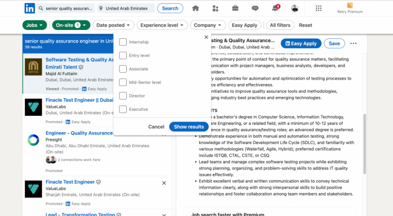

# Tips Mencari lowongan Kerja di Dubai/Abu Dhabi/UAE

## Optimalkan Profil LinkedIn
Sejauh pengalaman saya, perusahaan yang berbasis di Dubai/Abu Dhabi sangat aktif di LinkedIn, dan banyak perusahaan menggunakan platform ini untuk mengiklankan lowongan bahkan secara aktif head hunternya pun akan mencari melalui LinkedIn. 
Jadi Pastikan profil kamu lengkap, menonjolkan pengalaman dan keterampilan yang sesuai dengan bidang yang kamu incar. Gunakan kata kunci yang relevan dengan posisi yang kamu cari dan aktiflah berinteraksi dengan postingan terkait industri kamu agar mudah di temukan

Kamu juga bisa secara aktif untuk mencari lowongan di linkedin dengan memanfaatkan filter pencarian, pada umumnya pekerjaan on-site sudah memiliki kebijakan relokasi, jadi perusahaan bisa menanggung kebutuhan kamu untuk pindah ke negara UAE (tiket pesawat, visa, tempat tinggal sementara)

## Lamar di Situs Perusahaan
Banyak perusahaan di Dubai yang langsung memposting lowongan di situs resmi mereka. Jika kamu memiliki target perusahaan tertentu, cek halaman karir di situs perusahaan tersebut secara berkala, dan kirimkan aplikasi langsung jika ada posisi yang sesuai

## Komunitas
Komunitas seperti grup whatsap kita di UAE sesekali juga suka share informasi lowongan. Dan kita pun sering bantu repost di linkedin terkait hal itu, maka dari itu, sangat disarankan untuk berkoneksi di Linkedin dengan teman-teman yang sudah berkarir di UAE, bisa jadi untuk tambah koneksi, dan kita pun dengan senang hati berbagi peluang kerja dan tips wawancara

# Hal yang harus diwaspadai

Kota-kota besar di Timur Tengah memang sedang mengalami fase perkembangan startup baru yang pesat, menawarkan peluang besar untuk kamu bisa bergabung, tapi kamu juga harus waspada terhadap potensi lowongan kerja palsu atau scam. Jangan silau dengan nama Dubai/Abu Dhabi, kamu pun perlu melakukan riset mandiri ya. Sering kali ketika kamu tanya kenalan kamu di Dubai, mereka tidak pernah mendengar nama Perusahaan yang kamu tuju, bisa jadi karena saking banyaknya startup baru yang bermunculan
Berikut adalah beberapa hal yang perlu diwaspadai agar kamu tidak terjebak

## Periksa Alamat Email dan Situs Perusahaan
Perusahaan besar biasanya menggunakan alamat email resmi (misalnya, @companyname.com). Jika kamu menerima email dari domain umum seperti @gmail.com, @yahoo.com, atau domain yang mencurigakan, waspadalah!
Selalu periksa situs web resmi perusahaan untuk melihat apakah lowongan tersebut benar-benar ada, dan coba telusuri alamatnya di google maps!

## Waspadai Permintaan Uang untuk Proses Rekrutmen
Perekrut profesional atau perusahaan resmi tidak akan pernah meminta kamu membayar biaya apapun untuk proses lamaran, visa, atau pelatihan awal. Jika diminta untuk mengirim uang, ini adalah tanda peringatan besar bahwa lowongan tersebut kemungkinan besar adalah scam

## Cari Informasi tentang Perusahaan di Internet
Lakukan riset menyeluruh tentang perusahaan sebelum melamar. Gunakan situs web seperti Glassdoor atau LinkedIn untuk melihat ulasan karyawan sebelumnya atau membaca testimoni. Jika tidak ada informasi yang jelas atau testimoni mencurigakan, berhati-hatilah.

## Hati-hati dengan Proses Rekrutmen yang Terlalu Mudah atau Cepat
Jika kamu ditawari pekerjaan tanpa wawancara yang mendalam, atau jika proses rekrutmen terasa sangat cepat dan tidak masuk akal, ini bisa menjadi tanda bahwa itu adalah perusahaan abal-abal. 
Saya sendiri dulu waktu join pertama kali di perusahaan di Dubai, harus melalui 6 tahapan rekruitment, dari mulai HRD interview, assesment test, 2x interview teknikal, behaviour interview, sampai final interview dengan founder
Hampir semua proses interview tadi dilakukan melalui online, karena sangat lumrah untuk merekrut calon karyawan dari luar UAE

## Tinjau Kontrak Kerja dengan Cermat
Jika kamu mendapat tawaran kerja, pastikan kamu memeriksa kontrak dengan seksama. Perhatikan syarat dan ketentuan, dan jangan ragu untuk bertanya jika ada hal yang tidak jelas. Penawaran kontrak yang terlihat tidak profesional atau ambigu bisa jadi red flag sih.
Pastikan juga jumlah hari cuti, kebijakan remote, dan juga tunjangan dan benefit lain seperti subsidi pendidikan, traktir tiket mudik tahunan, sampai ke skema bonus.

## Konsultasi
Jika kamu masih perlu masukan dan opini dari rekan-rekan yang sudah bekerja di UAE sebagai bahan pertimbangan, jangan ragu untuk koneksi di Linkedin atau open issue tiket di repo ini, kita usahakan untuk bisa menjawab dengan segera

# Referensi
Saya sangat terbantu dengan video di playlist ini, ada baiknya juga buat temen-temen pelajari

- [Playlist selengkapnya](https://youtube.com/playlist?list=PLa-5UV8aqJHOzBM5RR06ImD7ma53XDKZh&si=za81cuB8bKGYT63i)