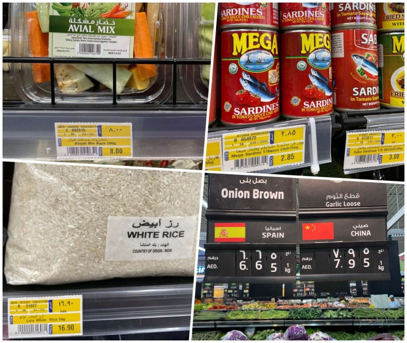

# Habibi, Welcome to Dubai

Selamat datang di Dubai, saya akan coba bagikan beberapa pengalaman yang saya harap bisa membantu kamu mengenal lebih cepat kota Dubai/Abu Dhabi, biar ga gagap budaya di awal seperti yang saya alami dulu

Nuansa bulan pertama sebenernya adalah bulan madu dengan kota Dubai, berasa seperti wisatawan, karena setiap hari bagi kamu adalah sebuah pelajaran baru, kalau belum bosen liat Burj Khalifa berarti masih di fase bulan madu ahaha

## Konversi Rupiah
Tentu kita secara naluriah menghitung segala biaya yang dikeluarkan di Dubai dengan nilai Rupiah, wajar aja sih karena most likely kamu akan menggunakan uang yang di dapatkan dengan bekerja (tabungan) di Indonesia, maka dari itu selama kita belum bisa membelanjakan pendapatan dengan uang dirham, kita haru bisa mengirit pengeluaran dari pundi rupiah kita, berikut ini ada beberapa tips untuk bisa hidup hemat di Dubai/Abu Dhabi

## Makan
Makanan Indonesia di Dubai pun ada, mudah di dapat tapi mahal, karena banyak bahan import, dan sebagian besar berbentuk restoran, makanan yang murah adalah makanan arab, dan India/Pakistan. Kalo di Jakarta, makanan arab itu termasuk makanan mahal, disini kita bisa makan setiap hari karena relatif lebih murah loh! (tentu kebalikannya dengan makan 1 gorengan bala-bala di Dubai bisa seharga 30ribu)

Menurut saya pribadi, lebih murah beli makan di luar daripada masak sendiri di rumah loh 😅, mungkin kalau untuk makan sekeluarga itu tentu bisa lebih murah masak sendiri, tapi kalau buat sendirian sih mahal ya, menurut saya kalau masak itu minimal harus siapin 3 jenis makanan, yaitu sayuran, protein (telur/daging/ikan) dan nasi, belanja bahan masakan aja kadang ga bisa dalam porsi kecil, jadi harus beli banyak dalam satu pack gitu (bisa disimpen di kulkas sih), belum minyak dan bumbunya ya, kalau saya hitung biayanya lebih mahal daripada beli makan di luar, apalagi restoran masakan india itu seperti nasi padang, kalau di bungkus porsinya jumbo! jadi sekali beli bisa buat 2x makan loh 🤣 nah pada kesempatan kali ini saya akan fokus pembahasanya adalah beli makan di luar dengan harga terjangkau ya, bukan masak sendiri biar hemat.

Dan untuk dapat makanan murah dan enak, sebenernya kita bisa mencari supermarket macam Carrefour, Spinney, Waitrose, atau Lulu, karena disana kita bisa menemukan makanan enak dan murah di kotak kaca ala warteg!
