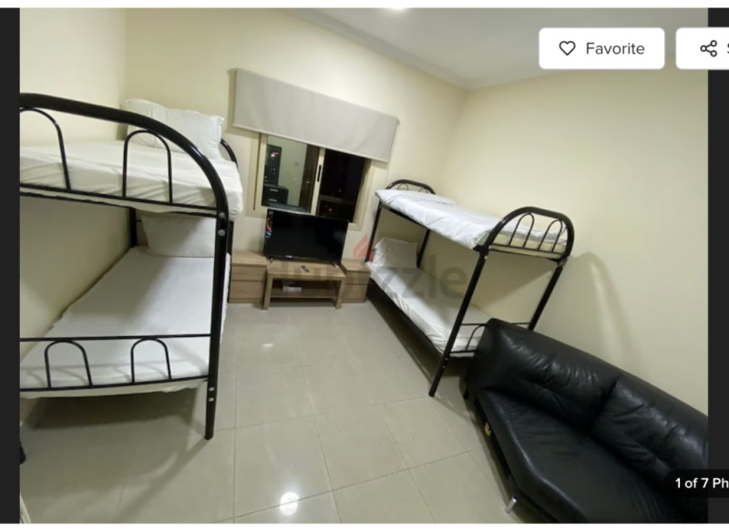
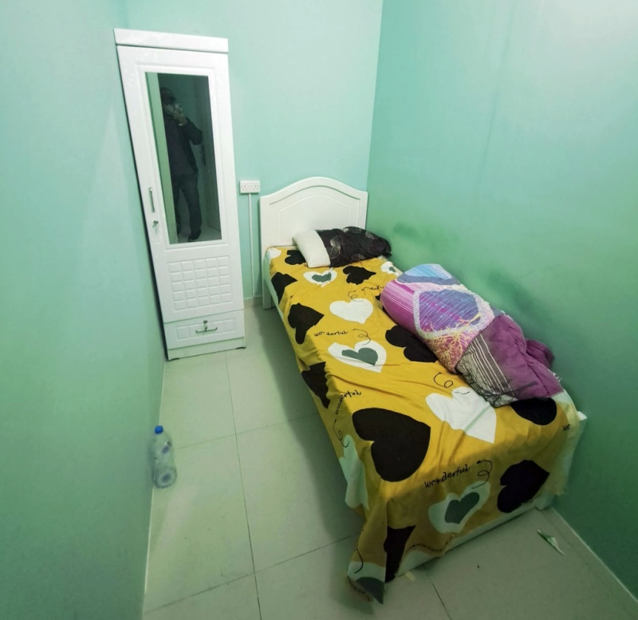

# Mencari Tempat Tinggal

Akomodasi adalah kebutuhan primer yang paling signifikan dalam biaya hidup di Dubai, ibaratnya kalo biaya makan itu bisa diakalin cara murahnya gimana, tapi klo biaya sewa tempat tinggal itu udah pasti sama perbulannya, jadi perlu cermat dalam memilih jenis tempat tinggal, karena biayanya sangat bervariasi, tergantung pada tipe properti, lokasi, dan fasilitas yang ditawarkan, dan kalo bisa cari tempat tinggal yang dekat dengan tempat kerja, klo naek metro harus dalam 1 zona biar hemat poll.

Yang pertama yang perlu dipahami adalah perbedaan bentuk sewa tempat tinggal seperti kosan antara Jakarta dan Dubai, yaitu:

## Apartment
- Tipe Studio (cocok buat yang sendirian)
- One/Two Bed room (keluarga)
- Sharing Apartemen
    - room sharing
    - partition
    - private (master) room
    - bed space
 

Biasanya klo tipe apartemen kalo sharing gini bentuknya tuh tipe kondominium yang luas tapi dipermak sedemikian rupa buat di sewain eceran gitu, lalu biaya sewa bulannya udah termasuk berbagai fasilitas umum:
- Internet high speed (biasanya diatas 250 mpbs)
- Air minum, gas & Listrik
- Kamar mandi diluar (air panas/dingin), biasanya satu apartemen ada 2 kamar mandi luar
- Dapur umum (bisa masak di kompor dan microwave)
- Mesin cuci & Setrikaan (ada yang termasuk keringin jadi ga perlu jemur)
- Tipe Rumah/Kamar di atas tanah:

Nanti akan saya jelasin perbedaannya satu-satu, tapi perlu dipahami dulu, bentuk hunian umum di Dubai itu adalah gedung apartemen, hampir ga ada pilihan rumah di atas tanah untuk hunian di pusat kota Dubai, kecuali jika melipir jauh lagi baru biasanya ada pilihan sewa rumah arab (rumah lama penduduk lokal) gitu yang disebutnya Villa.

### Bed Space
Secara harfiah adalah sewa kasur! Jadi cuma buat tidur aja gitu, ala backpacker. Ini adalah opsi paling murah, sewa perbulan sekitar 300 dirham (harga wajar 450ribuan) dan harga kasur bawah itu lebih mahal, biasanya satu apartemen gede akan dibagi beberapa kamar, di dalam kamar itu ada beberapa kasur untuk disewakan.

Dan penghuni kamarnya pun bisa beragam, bisa orang asia selatan, filipin, eropa atau afrika dalam satu ruangan, yang ga kuat denger suara ngorok mending jangan coba-coba deh 😅

Harganya AED500 perbulan, jadi kalo memang budget kamu terbatas, ini adalah pilihan paling murah, mungkin perlu diperhatikan barang pribadi bawaan, karena tentu saja sekamar akan diisi oleh beberapa orang, umumnya orang Indonesia tuh risih klo tidur sama orang asing, apalagi biasanya penghuni bedspace itu dari Asia Selatan, atau Filipina, kadang afrika juga ada

### Partition Room
Klo ini kita sewa satu kamar, jadi lebih ada privasinya ya, biasanya satu kondominium apartemen itu dibagi jadi banyak kamar, sempet suatu waktu pas lagi survei lokasi saya menghitung ga kurang dari 24 pintu untuk satu apartemen itu loh! dan kamar mandi luar nya cuma 2, ga kebayang antri mandinya tiap pagi itu loh 😱

Gambar di atas adalah contoh partition room yang saya sempet tinggali, lebarnya itu serentangan tangan aja, itu di foto aja keliatan ga sampe 3 ubin lebarnya, sempit banget ya 😅

Dulu di kamar itu saya bisa sewa klo perbulannya sekitar 1600 dirham (harga wajar 2,4jutaan, emang berasa mahal sih sekamar 3 ubin gini 🤣), fasilitasnya sama kayak di atas, dapet lemari baju, free internet, sharing kitchen dan kamar mandi di luar, dan selimut karena AC central nya dingin banget ga bisa dikecilin!

Oia biasanya variasi harga tergantung fasilitas juga, misal ada balkon nya, ada meja kerjanya atau bahkan ada jendelanya gitu juga bisa mempengaruhi harga loh.

... bersambung ...

### Apartemen Studio
### Apartemen One/two bed room
### Furnish/Non Furnish
### DEWA dan Biaya tambahan

## Villa
